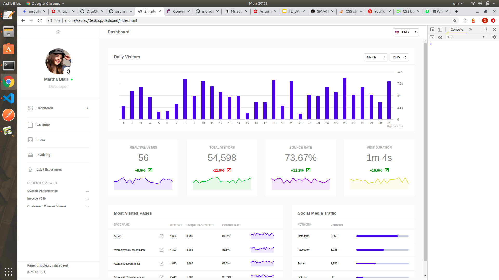

# dashboard     

~~~~sh
steps to run     
git clone       
run index.html in browser
Thats it you are good to go
~~~~    
### link for live demo is here    
https://sauravphulera.github.io/dashboardAssignment/

### The code is to create replica of following page    
   
    
#### This is what that is developed    

